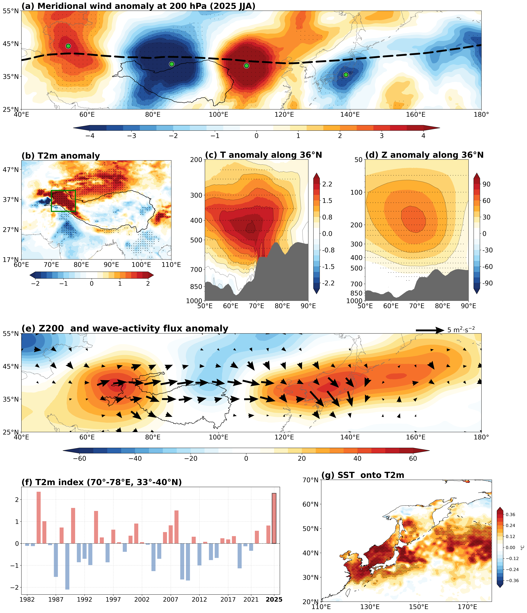

# Figure 3 — Upper-Tropospheric Circulation, Tibetan Plateau Heating, and the SST Link

This folder contains the code and final figure for **Figure 3** of the paper:

> **Teleconnection between Tibetan Plateau Warming and Marine Heatwave over the northwestern Pacific**
>
> Jianning Tao¹, Wei Hua¹\*, Huijun Wang²,³, Lihua Zhu¹, Xiaofei Wu¹, Shangru Li¹
>
> ¹ School of Atmospheric Sciences / Climate Change and Resource Utilization in Complex Terrain Regions Key Laboratory of Sichuan Province / Sichuan Provincial Engineering Research Center for Meteorological Disaster Prediction and Early Warning, Chengdu University of Information Technology, Chengdu, China
>
> ² State Key Laboratory of Climate System Prediction and Risk Management / Key Laboratory of Meteorological Disaster, Ministry of Education / Collaborative Innovation Center on Forecast and Evaluation of Meteorological Disasters, Nanjing University of Information Science and Technology, Nanjing, China
>
> ³ School of Atmospheric Sciences, Nanjing University of Information Science and Technology, Nanjing, China
>
> \* Corresponding author: Wei Hua

Figure 3 is a multi-row composite linking the 2025 summer (JJA) upper-tropospheric circulation and
western–Tibetan-Plateau thermal anomalies to the Northwestern Pacific SST response. Anomalies are
2025 JJA minus the 1982–2024 climatology; stippling marks where |anomaly| exceeds one interannual
standard deviation (panel g uses p < 0.05).



---

## Panels

| Panel | Content | Variable / source |
|-------|---------|--------------------|
| **(a)** | 200-hPa meridional-wind anomaly with the climatological summer westerly-jet axis (dashed) and anomaly centers | `v` @ 200 hPa (detrended) |
| **(b)** | 2 m air-temperature (T2m) anomaly map over the western Tibetan Plateau; green box = index region | `t2m` (detrended) |
| **(c)** | Air-temperature anomaly, longitude–pressure cross-section along 36°N (with topography) | `t` (detrended) |
| **(d)** | Geopotential-height anomaly, longitude–pressure cross-section along 36°N (with topography) | `z` (detrended) |
| **(e)** | Eddy Z200 anomaly with Plumb wave-activity flux (40–180°E, 20–60°N) | `z`, `u`, `v` |
| **(f)** | Standardized T2m index time series, 1982–2025 (70–78°E, 33–40°N box) | `t2m` (detrended) |
| **(g)** | Regression of JJA SST onto the standardized T2m index (hatching: p < 0.05) | `sst` (detrended) |

The dashed line in (a) is the climatological (1982–2024) latitude of maximum 200-hPa zonal wind at
each longitude. The green box in (b)/(f) marks the western-TP T2m index region (70–78°E, 33–40°N).

---

## Repository layout

```
fig3/
├── README.md
├── code/
│   └── plot_combined_multirow.py   # self-contained script that produces Figure 3
└── figures/
    └── combined_multirow_figure_new.png   # final Figure 3 (300 dpi)
```

> **Note:** Figure 3 is computed directly from the raw input fields and produces **no intermediate
> CSV files**. The script is fully self-contained — it imports no project modules.

## Requirements

- Python ≥ 3.10
- `numpy`, `scipy`, `xarray`, `matplotlib`, `cartopy`, `cmaps`

## Reproducing the figure

The script uses **absolute paths** pointing at the original compute environment. To regenerate
elsewhere, update the path constants near the top of `code/plot_combined_multirow.py` (`UVT_PATH`,
`Z_PATH`, `T2M_PATH`, `ORO_PATH`, `WORLD_SHP`, `TP_SHP`, `TP3000_SHP`, `DSST_PATH`) to your local
copies, then run:

```bash
python plot_combined_multirow.py
```

This writes `combined_multirow_figure_new.png` (300 dpi) next to the script.

## Input data

| Field | Panel(s) | Original path / product |
|-------|----------|--------------------------|
| `u`, `v`, `t` on pressure levels (summer, detrended) | (a), (c), (e) | `uvt_1_1000hpa_1982_2025_summer_detrended.nc` |
| Geopotential height `z` (1000–50 hPa, JJA, detrended) | (d), (e) | `ERA5/Z_1000_50hpa_1982_2025_JJA_detrended.nc` |
| 2 m temperature `t2m` (detrended) | (b), (f) | `t2m_1982_202601_detrended.nc` |
| Model orography / geopotential `z` | (c), (d) topography | `SHP/dixing/geo.nc` |
| Detrended SST | (g) | `dSST_detrended_signal.nc` |
| World continent shapefile | map land masks | `WORLD_SHP/continent.shp` |
| Tibetan Plateau boundary (2021) | (a), (b) | `TP_SHP/TPBoundary_new(2021)/...` |
| Tibetan Plateau 3000 m boundary | (e) | `TP_SHP/TPBoundary_3000m/...` |

## Citation

If you use this code or figure, please cite the paper above. Code released to accompany the paper.
